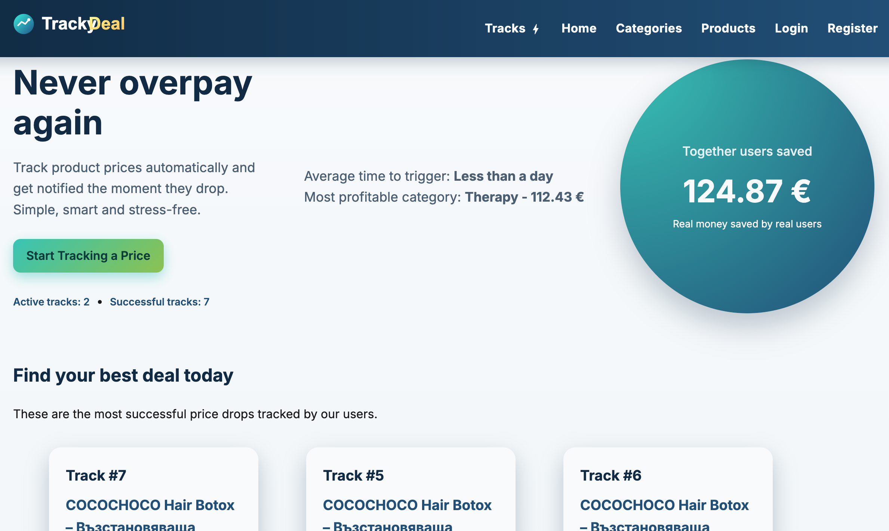
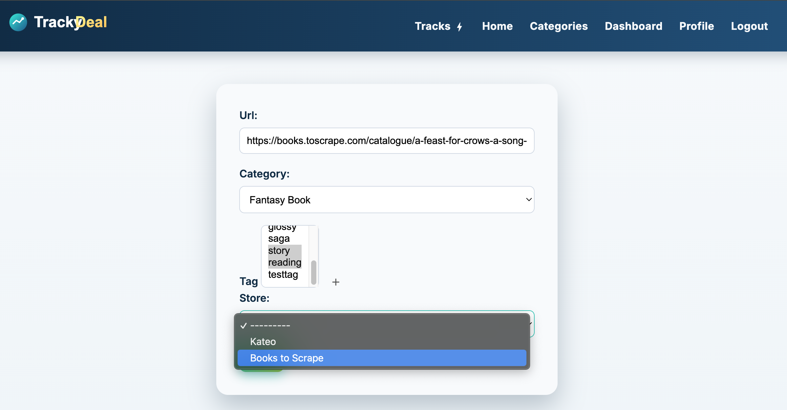
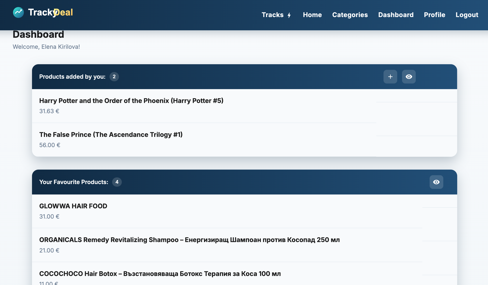
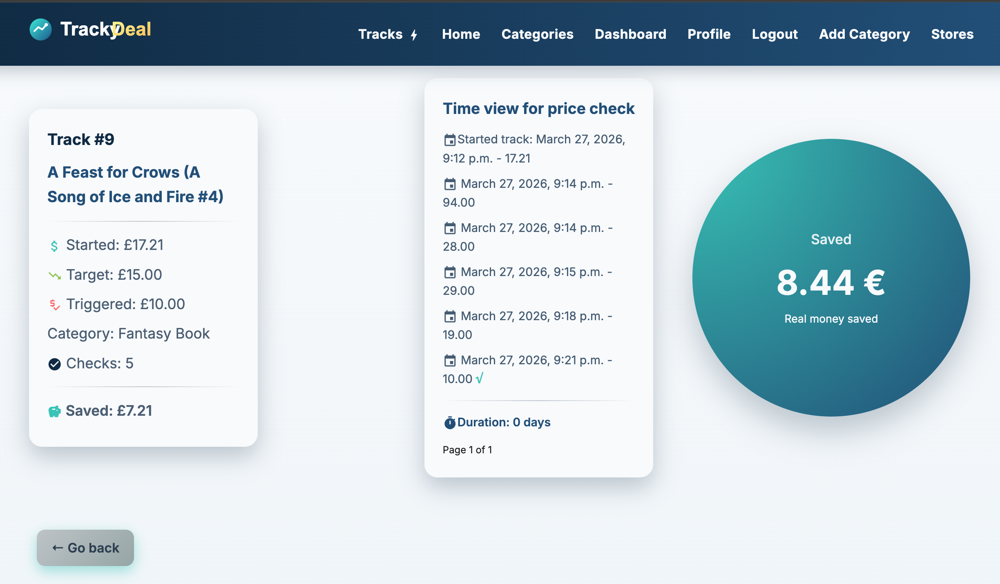

# Tracky Deal (Price Tracking System)

A Django web application for product price tracking and alert triggering.

---

## Overview

A Django-based web application that allows users to track product prices from online stores and receive notifications when prices drop below a desired target price

Live Demo
https//...
---

## Core Features

1. User Management:
- Custom user model (email-based authentication)
- Registration, login, logout
- Password reset via email
- User dashboard and profile

2. Product Tracking
- Add products via URL (automatic scraping)
- Supports multiple stores (extensible scraper system)
- Automatic price updates

3. Alerts System
- Set target price for products
- Email notifications on price drop
- Alert lifecycle: Active → Triggered → Archived

4. Analytics & History
- Price timeline tracking
- Archive of successful alerts
- Saved money calculation
- Category performance statistics

5. Background Processing:
- Celery for asynchronous tasks
- Redis as message broker
- Scheduled price checks

---

## How It Works

1. A product has one or more active alerts.
2. Each alert stores:
   - target price
   - starting price
   - tracking state
3. When a price is triggered:
   - All active alerts for that product are evaluated.
   - If `current_price <= target_price`:
     - The alert is archived.
     - A email notification is generated.
4. The track is archived.

---

## Tech Stack

- Backend: Django 6
- Database: PostgreSQL
- Task Queue: Celery
- Broker: Redis
- Frontend: Django Templates (HTML, CSS, JS)
- API: Django REST Framework
- Deployment: Azure
- Security: django-axes (brute-force protection)
---
## Future improvement:
- Price charts visualization
- Docker containerization
- Caching with Redis
- UI/UX improvements
---
## Security
	•	CSRF protection on all forms
	•	Custom authentication system
	•	Password validation
	•	Brute-force protection via django-axes
	•	Environment-based configuration (.env)
	•	No sensitive data stored in code
## Architecture Overview
	•	Django MVC pattern
	•	Service layer (business logic separation)
	•	Celery for async background processing
	•	Scraper abstraction (Open/Closed principle)
	•	PostgreSQL relational database
	•	Redis for task queue

## Demo Access
You can test the app using:

    User:
    •	Email: appuser@manager.com
    •	Password: 12Test34
    Moderator:
    •	Email: moderator@moderator.com
    •	Password: 12Test34


---
## Setup Instructions
1. Clone the repository.
```bash
git clone https://github.com/ElenaKirilovaA/price_tracker.git
cd price_tracker
```
2. Create a virtual environment:
```bash
python -m venv venv
source .venv/bin/activate  # MAC/Linux
venv\Scripts\activate  # Windows
```
3. Install requirements.txt
```bash
pip install -r requirements.txt
```
4. Create .env file in the root of the project and copy from .env_copy and fill in with your own values
```bash
SECRET_KEY=your.secret_key
DEBUG=
DB_NAME=your.db_name
DB_USER=your.db_user
DB_PASSWORD=your.db_password
HOST=your.host
PORT=your.posrt
EMAIL_HOST_USER=your.email_host
EMAIL_HOST_PASSWORD=your.email_hotst_password
ALLOWED_HOSTS=your.allowed_hosts
CELERY_BROKER_URL=your.celery_broker # Redis Cloud Your Redis URL
CELERY_RESULT_BACKEND=your.celery_backend # Redis Cloud
```
5. Apply migrations. User groups are created automatically via data migrations
```bash
python manage.py migrate
```
6. Create Superuser
```bash
python manage.py createsuperuser
```

7. Run the Application
```bash
python manage.py runserver
```

8. Starts worker
```bash
celery -A price_tracker worker -l info
```

9. Start scheduler (CeleryBeat)

```
celery -A price_tracker beat -l info
```
---
## Future improvements
- Price charts visualization
- Docker containerization
- UI/UX improvements

---
## Screenshots

### Home Page


### Add Product From Selected Store


### AppUser Dashboard


### Archived Track Info With Price Timeline



## Author

Elena Kirilova

