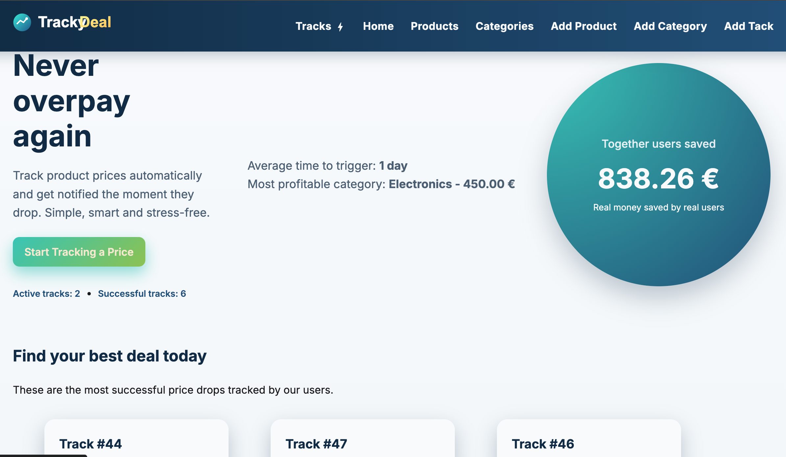
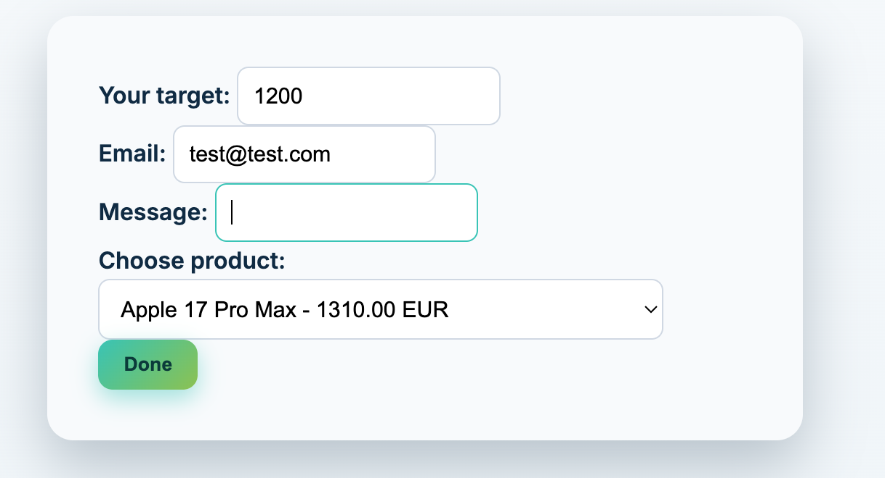
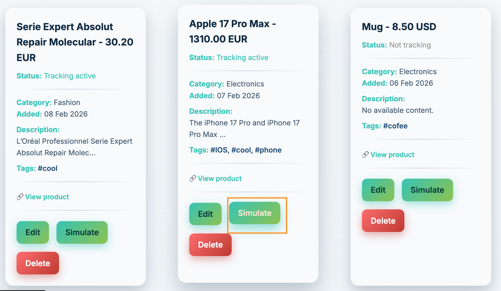
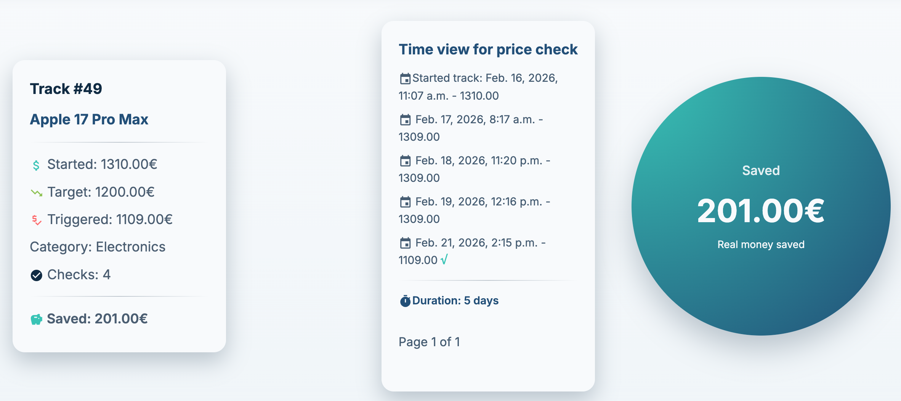

# Tracky Deal (Simulation-Based Price Tracking System)

A Django web application that simulates product price tracking and alert triggering using clean architecture principles.

---

## Overview

This project demonstrates a backend architecture for handling price tracks, business logic separation, and state transitions between active and archived alerts.

Instead of **automatic** background monitoring, the system uses **manual price simulation** to trigger alert evaluation. This allows the focus to remain on:

- Clean service-layer design
- Query optimization
- Model managers
- State transitions
- Business rule encapsulation

---

## Core Features

- Create price track for products
- Manual simulation of price checks / edit price -> simulate button /
- Price track snapshot each time the price is checked
- Alert triggering when simulated price reaches target
- Archive of triggered tracks
- Saved money calculation (started vs triggered price)
- Separation of concerns (views vs service layer)

---

## How It Works

1. A product has one or more active alerts.
2. Each alert stores:
   - target price
   - starting price
   - tracking state
3. When a price simulation is triggered:
   - All active alerts for that product are evaluated.
   - If `current_price <= target_price`:
     - The alert is archived.
     - A console notification is generated.
4. The track is archived.

---

Business logic is intentionally extracted from views to maintain clean controllers and testable services.

---

## Tech Stack

- Python 3.11+
- Django
- PostgreSQL
- HTML / CSS

## Future improvement:
- Background price checks (Celery + Redis)
- Real email notifications
- User authentication system
- REST API layer
- Deployment to cloud platform

---
## Setup Instructions

```bash
git clone https://github.com/YOUR_USERNAME/price_tracker.git
cd price_tracker

python -m venv venv
source .venv/bin/activate

pip install -r requirements.txt

python manage.py pigrate

python manage.py runserver

```
---

## Screenshots

### Home Page


### Create Track


### Simulation Track After Price Edit


### Archived Track Info



## Author

Elena Kirilova

